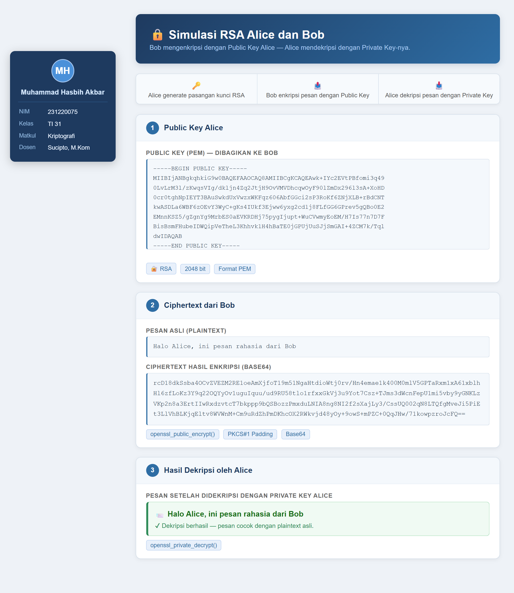

# 🔐 Kriptografi RSA: Tiga Simulasi Enkripsi Asimetrik

Aplikasi web interaktif yang komprehensif untuk mempelajari dan mensimulasikan **algoritma RSA (Rivest–Shamir–Adleman)** melalui tiga modul praktis dengan antarmuka yang responsif dan user-friendly.

---

## 📋 Gambaran Umum: 3 Tugas Kriptografi

Proyek ini merupakan **tugas mata kuliah Kriptografi** yang terdiri dari **3 modul independen**, masing-masing mendemonstrasikan aspek berbeda dari enkripsi RSA:

| # | Tugas | Folder | Deskripsi | Fitur Utama |
|---|-------|--------|-----------|------------|
| **1** | **RSA Simulation** | `rsa-simulation/` | Simulasi komunikasi satu arah antara Alice & Bob | Pembangkitan keypair RSA, enkripsi pesan, dekripsi pesan |
| **2** | **Digital Signature Verifier** | `verifikatordokumen/` | Tanda tangan digital dan verifikasi autentikasi dokumen | Generate key, sign message, verifikasi signature, deteksi MITM |
| **3** | **SSL Certificate Generator** | `ssl-generator/` | Generator SSL/TLS certificate self-signed | Generate private key, CSR, dan self-signed certificate |

---

### 🎯 Tujuan Pembelajaran

✅ **Tugas 5 - RSA_Simulation**: Memahami enkripsi & dekripsi asimetrik dalam komunikasi point-to-point  
✅ **Tugas 6 - verifikatordokumen (Digital Signature)**: Memahami digital signature untuk autentikasi dan non-repudiation  
✅ **Tugas 7 - SSL_Generator**: Memahami sertifikat SSL/TLS dan infrastruktur HTTPS  

---

## 📸 Preview Aplikasi

### Tugas 1 - Simulasi RSA (Alice & Bob)


**Keterangan:**
- Sidebar Kiri: Identity card (desktop) / Topbar (mobile)
- Header: Judul dengan deskripsi
- Flow Bar: 3 tahap proses (Generate → Encrypt → Decrypt)
- Section 1: Public Key Alice (format PEM)
- Section 2: Plaintext dan Ciphertext (Base64)
- Section 3: Decrypted message dengan verifikasi

---

## 📖 Deskripsi Detail Setiap Modul

### **Tugas 1️⃣ - RSA Simulation: Alice & Bob** (`rsa-simulation/`)

**Deskripsi**: Simulasi komunikasi aman satu arah menggunakan enkripsi RSA antara Alice (penerima) dan Bob (pengirim).

**Skenario Alur:**
```
┌─────────────┐                              ┌─────────────┐
│   ALICE     │                              │     BOB     │
│             │                              │             │
│ • Generate  │         Public Key           │ • Encrypt   │
│   Keypair   │◄─────────────────────────────│   Message   │
│ (RSA 2048)  │                              │   (with PK) │
│             │                              │             │
│ • Decrypt   │      Ciphertext (Base64)     │             │
│   Message   │◄─────────────────────────────│             │
│ (with SK)   │                              │             │
└─────────────┘                              └─────────────┘
```

**Tahapan Proses:**
1. **Alice** membuat pasangan kunci RSA 2048-bit
   - Public Key → dibagikan ke Bob (bersifat publik)
   - Private Key → dijaga rahasia (hanya Alice)

2. **Bob** mengenkripsi pesan menggunakan Public Key Alice
   - Pesan asli (plaintext) dienkripsi dengan algoritma RSA
   - Hasil enkripsi dikodekan dalam Base64 untuk ditransmisikan

3. **Alice** mendekripsi pesan menggunakan Private Key-nya
   - Ciphertext diubah kembali menjadi plaintext asli
   - Verifikasi kesesuaian dengan pesan awal

**Fitur Utama:**
✅ Pembangkitan kunci RSA 2048-bit secara dinamis  
✅ Enkripsi dengan `openssl_public_encrypt()` + PKCS#1 padding  
✅ Dekripsi dengan `openssl_private_decrypt()`  
✅ Output Base64-encoded untuk transmisi aman  
✅ Responsive design (desktop & mobile)  
✅ Toggle expand/collapse untuk public key panjang  

**Akses**: `http://localhost/rsa-simulation/` atau `http://localhost:8000/rsa-simulation/`

---

### **Tugas 2️⃣ - Digital Signature Verifier** (`verifikatordokumen/`)

**Deskripsi**: Demonstrasi tanda tangan digital RSA-2048 dengan SHA-256 untuk autentikasi dokumen dan deteksi Man-in-the-Middle (MITM).

**Skenario Alur:**
```
┌─────────────────────┐          ┌──────────────────┐         ┌─────────────────┐
│   PENGIRIM (Signer) │          │  SALURAN TRANSMISI│        │  PENERIMA (Verifier)│
│                     │          │  (Mungkin MITM)  │         │                 │
│ 1. Generate Keys    │          │                  │         │ 3. Terima:      │
│ 2. Sign Message     │────→─────│──────Signature───────→─────│   • Signature   │
│    (with Private)   │   +      │                  │    +    │   • Message     │
│                     │────→─────│──────Message─────────→─────│ 4. Verify       │
│                     │          │                  │         │   (with Public) │
└─────────────────────┘          └──────────────────┘         └─────────────────┘

Jika pesan dimanipulasi → Signature tidak cocok ❌
Jika tanda tangan palsu → Verifikasi gagal ❌
Jika semuanya asli → Verifikasi berhasil ✅
```

**Tahapan Proses:**
1. **Pengirim** membuat signature pada dokumen/pesan
   - Private Key digunakan untuk membuat signature
   - SHA-256 sebagai hash function
   - Output: Base64-encoded signature

2. **Transmisi** (simulasi MITM attack)
   - Pesan dapat dimanipulasi saat transmisi
   - Signature akan tidak cocok jika ada perubahan

3. **Penerima** memverifikasi signature
   - Public Key digunakan untuk verifikasi
   - Jika cocok → pesan autentik
   - Jika tidak → ada manipulasi atau signature palsu

**Fitur Utama:**
✅ Generate RSA keypair 2048-bit dengan SHA-256  
✅ Sign dokumen dengan private key  
✅ Verify signature dengan public key  
✅ Deteksi MITM attack (pesan diubah)  
✅ Penyimpanan key di `keys/` folder  
✅ JSON API endpoints (generate_key.php, sign.php, verify.php)  
✅ UI interaktif dengan 3-column layout  

**Fitur Spesial:**
- **Copy to Verify**: Tombol otomatis copy signature ke section verify
- **Simulasi MITM**: Pesan dimodifikasi otomatis ("Jokw" → "Widodd") untuk menunjukkan gagal verifikasi
- **Timestamp**: Setiap operasi menampilkan waktu eksekusi

**Akses**: `http://localhost/verifikatordokumen/` atau `http://localhost:8000/verifikatordokumen/`

**Endpoints API:**
- `POST generate_key.php` → Generate RSA keypair
- `POST sign.php?message=<text>` → Buat signature
- `POST verify.php?message=<text>&signature=<sig>` → Verifikasi signature

---

### **Tugas 3️⃣ - SSL Certificate Generator** (`ssl-generator/`)

**Deskripsi**: Generator self-signed SSL/TLS certificate untuk HTTPS dengan RSA 2048-bit dan SHA-256.

**Skenario Penggunaan:**
```
┌──────────────────┐                    ┌─────────────────────┐
│  Developer/Admin │                    │   Web Server        │
│                  │                    │  (Apache/Nginx)     │
│ 1. Fill Form     │                    │                     │
│    (C, ST, O,    │──Generate CSR──→   │ 2. Install          │
│     CN)          │    & Sign          │    Certificate      │
│                  │←─Certificate.crt───│ 3. Enable HTTPS     │
│ 2. Download      │                    │ 4. Serve HTTPS      │
│    • private.key │                    │                     │
│    • cert.crt    │                    │                     │
└──────────────────┘                    └─────────────────────┘
```

**Tahapan Proses:**
1. **Form Input**: User mengisi data sertifikat
   - Country (C): 2 huruf kode negara
   - State/Province (ST): Nama provinsi
   - Locality (L): Kota
   - Organization (O): Nama organisasi
   - Common Name (CN): Domain atau identitas utama

2. **Pembangkitan Key & CSR**
   - Generate RSA private key 2048-bit
   - Buat Certificate Signing Request (CSR)
   - Self-sign certificate untuk 365 hari

3. **Output & Download**
   - Private Key (PEM format)
   - Self-Signed Certificate (CRT format)
   - User dapat mendownload kedua file

**Fitur Utama:**
✅ Generate RSA private key 2048-bit  
✅ Buat Certificate Signing Request (CSR)  
✅ Self-sign certificate dengan SHA-256  
✅ Validitas certificate: 365 hari  
✅ Output format: PEM (key) dan DER/PEM (certificate)  
✅ Download file langsung dari browser  
✅ Modern UI dengan ambient effects  
✅ How-It-Works section dengan step-by-step explanation  

**Keamanan Catatan:**
⚠️ **Self-signed certificates** untuk development/testing saja  
⚠️ Browser akan warn "Not Secure" karena bukan dari CA terpercaya  
✅ Tetap aman untuk enkripsi data di transit  
✅ Solusi produksi: gunakan CA seperti Let's Encrypt

**Akses**: `http://localhost/ssl-generator/` atau `http://localhost:8000/ssl-generator/`

---

## 🛠️ Teknologi yang Digunakan

| Komponen | Teknologi |
|----------|-----------|
| **Backend** | PHP 7.0+ |
| **Enkripsi** | OpenSSL (PHP Extension) |
| **Frontend** | HTML5, CSS3, JavaScript Vanilla |
| **Cryptography** | RSA-2048, SHA-256, PKCS#1 padding |
| **Server** | Apache/Nginx (XAMPP/Laragon) |
| **Styling** | CSS Grid, Flexbox, Responsive Design |

---

## 🖥️ Requirements & Instalasi

### Sistem Requirements
- **PHP 7.0+** (atau PHP 8.0+)
- **OpenSSL PHP Extension** (`php_openssl.dll` untuk Windows)
- **Web Server**: Apache/Nginx
- **Environment**: XAMPP, Laragon, atau Linux Server

### Kompatibilitas
✅ Windows (XAMPP, Laragon)  
✅ Linux/macOS  
✅ Cloud Hosting (Shared Hosting dengan PHP+OpenSSL)  

### Langkah Instalasi

**1. Clone Repository**
```bash
git clone <repository-url>
cd rsa-simulation-PHP-by-MuH-Akbar
```

**2. Konfigurasi OpenSSL (Auto-detect Multi-Platform)**

Aplikasi sudah dilengkapi dengan **auto-detection function** yang mencari `openssl.cnf` dari berbagai lokasi:

**Windows:**
- `C:/xampp/php/extras/ssl/openssl.cnf`
- `C:/xampp/apache/conf/openssl.cnf`
- `C:/laragon/bin/apache/openssl.cnf`
- `C:/laragon/bin/php/extras/ssl/openssl.cnf`

**Linux/macOS:**
- `/etc/ssl/openssl.cnf`
- `/usr/local/etc/openssl/openssl.cnf`
- `/etc/openssl/openssl.cnf`
- `/usr/lib/ssl/openssl.cnf`

**Cloud Hosting:**
- Environment variable `OPENSSL_CONF`
- System default (fallback)

**Cara Kerja:**
1. ✅ Aplikasi otomatis mencari file `openssl.cnf`
2. ✅ Jika ditemukan → langsung digunakan
3. ✅ Jika tidak ditemukan → gunakan default sistem
4. ✅ Bisa di-override via environment variable

**Manual Setup (jika perlu):**
```php
// Di awal PHP file atau .htaccess
putenv("OPENSSL_CONF=/path/to/openssl.cnf");
```

**Debug/Check Konfigurasi:**
```
Akses: http://localhost:8000/SSL_Generator/info.php
(Halaman ini menampilkan OpenSSL config yang terdeteksi)
```

**3. Buat Folder untuk Tugas 2 (Digital Signature)**
```bash
mkdir verifikatordokumen/keys
chmod 755 verifikatordokumen/keys  # Linux/macOS
```

**4. Jalankan di Local Server**

```bash
# Opsi A: PHP Built-in Server
php -S localhost:8000

# Opsi B: Via XAMPP
# Letakkan di: C:\xampp\htdocs\rsa-simulation-PHP-by-MuH-Akbar
# Akses: http://localhost/rsa-simulation-PHP-by-MuH-Akbar
```

---

## 🚀 Cara Menggunakan

### Tugas 1 - RSA Simulation
1. Buka `http://localhost:8000/rsa-simulation/`
2. Halaman otomatis:
   - Generate keypair RSA 2048-bit untuk Alice
   - Encrypt pesan Bob dengan public key
   - Decrypt ciphertext dengan private key Alice
3. Lihat hasil di 3 section:
   - Section 1: Public Key Alice
   - Section 2: Plaintext & Ciphertext
   - Section 3: Decrypted message + verifikasi

### Tugas 2 - Digital Signature Verifier
1. Buka `http://localhost:8000/verifikatordokumen/`
2. **Generate Key**: Klik tombol → RSA keypair dibuat & disimpan
3. **Sign Data**: Ketik pesan → Klik Sign → Signature dibuat
4. **Verify Signature**: 
   - Pilihan A: Klik "Copy to Verify" (dengan simulasi MITM)
   - Pilihan B: Paste manually tanpa perubahan
   - Klik Verify → Lihat hasil (valid/invalid)

### Tugas 3 - SSL Certificate Generator
1. Buka `http://localhost:8000/ssl-generator/`
2. Isi form dengan data sertifikat:
   - Country: ID (atau kode negara lain)
   - State: Contoh: "Jawa Barat"
   - Locality: Contoh: "Bandung"
   - Organization: Contoh: "My Company"
   - Common Name: Contoh: "example.com"
3. Klik "Generate Certificate"
4. Download hasil:
   - Private Key (private.key)
   - Certificate (certificate.crt)
5. Install di web server untuk enable HTTPS

---

## 📊 Struktur Kode & File

### 📚 Skenario Simulasi

```
┌─────────────┐                              ┌─────────────┐
│   ALICE     │                              │     BOB     │
│             │                              │             │
│ • Generate  │         Public Key           │ • Encrypt   │
│   Keypair   │◄─────────────────────────────│   Message   │
│ (RSA 2048)  │                              │   (with PK) │
│             │                              │             │
│ • Decrypt   │      Ciphertext (Base64)     │             │
│   Message   │◄─────────────────────────────│             │
│ (with SK)   │                              │             │
└─────────────┘                              └─────────────┘
```

#### Alur Kerja:
1. **Alice** membuat pasangan kunci RSA (2048-bit)
   - Public Key → dibagikan ke Bob
   - Private Key → dijaga rahasia

2. **Bob** mengenkripsi pesan menggunakan Public Key Alice
   - Pesan asli (plaintext) dienkripsi
   - Hasil enkripsi dikodekan dalam Base64

3. **Alice** mendekripsi pesan menggunakan Private Key-nya
   - Ciphertext didekripsi
   - Pesan asli pulih dengan aman

---

## 🛠️ Fitur Utama

✅ **Pembangkitan Kunci RSA Dinamis**
- Menghasilkan pasangan kunci RSA 2048-bit secara real-time
- Format PEM (Privacy Enhanced Mail)

✅ **Enkripsi Pesan**
- Menggunakan `openssl_public_encrypt()`
- Padding scheme: PKCS#1
- Output: Base64-encoded

✅ **Dekripsi Pesan**
- Menggunakan `openssl_private_decrypt()`
- Verifikasi kesesuaian pesan asli

✅ **Antarmuka yang Responsif**
- Desktop: Layout sidebar (identity card tetap di kiri)
- Mobile: Layout yang optimal untuk layar kecil
- Toggle expand/collapse untuk key panjang

✅ **Error Handling**
- Penanganan error generation kunci
- Penanganan error enkripsi/dekripsi
- Pesan error yang informatif

---

## 🖥️ Teknologi yang Digunakan

| Komponen | Teknologi |
|----------|-----------|
| Backend | PHP 7.0+ |
| Enkripsi | OpenSSL (PHP Extension) |
| Frontend | HTML5, CSS3 |
| Interaktif | JavaScript Vanilla |
| Environment | XAMPP / Laragon / Linux Server |

---

## 📋 Requirements

### Sistem
- PHP 7.0 atau lebih baru
- OpenSSL PHP Extension (`php_openssl`)
- Web Server (Apache/Nginx)

### Kompatibilitas
✅ Windows (XAMPP, Laragon)
✅ Linux/macOS
✅ Cloud Hosting (Shared Hosting)

---

## ⚙️ Instalasi & Setup

### 1. Clone Repository
```bash
git clone <repository-url>
cd rsa-simulation-PHP-by-MuH-Akbar
```

### 2. Konfigurasi OpenSSL (Windows XAMPP)
Aplikasi secara otomatis mencari `openssl.cnf` di lokasi umum:
```
C:/xampp/apache/conf/openssl.cnf
C:/xampp/php/extras/openssl/openssl.cnf
C:/laragon/bin/apache/openssl.cnf
/etc/ssl/openssl.cnf (Linux/macOS)
```

Jika tidak ditemukan, set manual:
```php
putenv("OPENSSL_CONF=/path/to/openssl.cnf");
```

### 3. Jalankan di Local Server
```bash
# Gunakan PHP built-in server
php -S localhost:8000

# Atau via XAMPP
# Letakkan di: C:\xampp\htdocs\rsa-simulation-PHP-by-MuH-Akbar
# Akses: http://localhost/rsa-simulation-PHP-by-MuH-Akbar
```

---

## 🚀 Penggunaan

1. Buka aplikasi di browser
2. Halaman akan otomatis:
   - Membuat pasangan kunci RSA
   - Mengenkripsi pesan demo dari Bob
   - Mendekripsi pesan menggunakan Private Key Alice
3. Lihat hasil lengkap di ketiga section:
   - **Section 1**: Public Key Alice (dapat diexpand)
   - **Section 2**: Pesan asli dan Ciphertext
   - **Section 3**: Hasil dekripsi dan verifikasi

---

## 📊 Struktur Kode

### Bagian 1: Setup Alice (Generate Keypair)
```php
$config = [
    'private_key_bits' => 2048,
    'private_key_type' => OPENSSL_KEYTYPE_RSA,
];
$keyPair = openssl_pkey_new($config);
```

### Bagian 2: Bob Encrypt
```php
$plaintext = "Halo Alice, ini pesan rahasia dari Bob";
openssl_public_encrypt($plaintext, $ciphertext, $publicKey);
```

### Bagian 3: Alice Decrypt
```php
openssl_private_decrypt($ciphertext, $decrypted, $privateKey);
```

---

## 🎨 Antarmuka Pengguna

### Desktop View
- **Identity Card**: Fixed sidebar di kiri (210px)
- **Main Content**: Flow bar + 3 section card
- **Key Box**: Scrollable, collapsible jika diexpand

### Mobile View
- **Identity Card**: Horizontal topbar dengan chips
- **Main Content**: Full width layout
- **Key Box**: Collapsed by default, expandable dengan button

### Fitur Interaktif
- Toggle button untuk expand/collapse public key
- Responsive design untuk berbagai ukuran layar
- Color scheme profesional (blue theme)

---

## 📝 Informasi Pembuat

| Item | Keterangan |
|------|-----------|
| **Nama** | Muhammad Hasbih Akbar |
| **NIM** | 231220075 |
| **Kelas** | TI 31 (Teknik Informatika) |
| **Mata Kuliah** | Kriptografi |
| **Dosen** | Sucipto, M.Kom |
| **Institusi** | Universitas |

---

## 🌐 Live Demo

Aplikasi ini telah di-deploy dan dapat diakses di:

🔗 **[https://muhakbar-rsa-simulation.infinityfree.me/](https://muhakbar-rsa-simulation.infinityfree.me/)**

### ⚠️ Catatan Hosting - InfinityFree

**Keterbatasan SSL di InfinityFree:**

InfinityFree adalah layanan free hosting yang memiliki beberapa keterbatasan, khususnya:

1. **SSL/TLS Support Terbatas**
   - InfinityFree tidak menyediakan SSL certificate untuk subdomain custom secara native
   - Domain custom (`.infinityfree.me`) tidak support HTTPS penuh
   - Aplikasi ini berjalan di protokol HTTP (tidak terenkripsi)

2. **Implikasi untuk Aplikasi RSA**
   - ✅ Enkripsi RSA tetap berfungsi dengan baik di aplikasi
   - ✅ Semua proses enkripsi terjadi di **server-side PHP**, bukan di browser
   - ⚠️ Transmisi data antara browser dan server tidak terenkripsi oleh SSL
   - ⚠️ Hanya cocok untuk **keperluan edukasi/demonstrasi**, bukan production

3. **Solusi Alternatif Hosting**
   Untuk mendapatkan SSL support penuh, gunakan:
   - **Netlify** / **Vercel** (untuk static sites)
   - **Heroku** / **Render** (free tier dengan SSL)
   - **PythonAnywhere** (untuk Python+Web apps)
   - **000webhost** (free hosting dengan SSL gratis)
   - **VPS Murah** (DigitalOcean, Linode, Vultr - ~$5/bulan)

4. **Best Practice untuk Production**
   ```
   ┌─────────────────────────────────┐
   │ Client (HTTPS) ◄──────► Server  │
   │                  SSL/TLS         │
   │                                 │
   │ Browser  ──encrypt──►  RSA      │
   │ (HTTPS)               Encrypt   │
   └─────────────────────────────────┘
   ```
   - Gunakan HTTPS untuk seluruh komunikasi
   - Simpan private key di server dengan permission terbatas
   - Jangan expose private key di source code publik

5. **Keamanan Aplikasi Ini**
   - ✅ Aman untuk tujuan **pembelajaran/demonstrasi**
   - ✅ Cocok untuk **tugas akademik**
   - ❌ **Tidak aman untuk data sensitif real-world**
   - ❌ **Jangan gunakan untuk transaksi/data pribadi**

---

## 📚 Referensi & Teori RSA

### Konsep Dasar
**RSA** adalah algoritma enkripsi asimetrik yang menggunakan sepasang kunci:
- **Public Key (n, e)**: Digunakan untuk enkripsi, boleh dibagikan
- **Private Key (n, d)**: Digunakan untuk dekripsi, harus dirahasiakan

### Rumus Matematika
- **Enkripsi**: C ≡ M^e (mod n)
- **Dekripsi**: M ≡ C^d (mod n)

### Keamanan RSA
- Kesulitan memfaktorkan bilangan besar (Factoring Problem)
- 2048-bit RSA dianggap aman hingga tahun 2030-an
- Tidak rentan terhadap serangan brute-force dalam waktu praktis

### Padding Scheme
- **PKCS#1 v1.5**: Standar yang digunakan dalam aplikasi ini
- Menambahkan random padding untuk keamanan tambahan
- Mencegah known plaintext attack

---

## ⚠️ Catatan Penting

1. **Security Notice**: 
   - Aplikasi ini untuk tujuan **edukasi dan demonstrasi**
   - Untuk production, gunakan library cryptography yang telah teruji
   - Jangan simpan private key di log atau file tanpa enkripsi

2. **Performance**:
   - Pembangkitan kunci 2048-bit memerlukan waktu ~1-2 detik
   - Enkripsi/dekripsi cukup cepat (<100ms)

3. **Kompatibilitas Browser**:
   - Chrome, Firefox, Safari, Edge (semua versi modern)
   - IE11 tidak fully supported

---

## � Troubleshooting & FAQ

### ⚠️ OpenSSL Configuration Error

**Error: "Gagal membuat RSA Private Key" / "Gagal membuat CSR"**

**Penyebab:** OpenSSL config path tidak valid atau tidak ditemukan

**Solusi:**

1. **Check Konfigurasi (Debug Page):**
   ```
   Kunjungi: http://localhost:8000/SSL_Generator/info.php
   Halaman ini menampilkan OpenSSL config yang terdeteksi di sistem
   ```

2. **Manual Set Environment Variable:**
   
   Tambahkan di awal file `SSL_Generator/index.php`:
   ```php
   putenv("OPENSSL_CONF=C:/xampp/php/extras/ssl/openssl.cnf");
   // atau
   putenv("OPENSSL_CONF=/etc/ssl/openssl.cnf");
   ```

3. **Via .htaccess (Apache):**
   ```apache
   SetEnv OPENSSL_CONF /path/to/openssl.cnf
   ```

4. **Hosting Web - Hubungi Provider:**
   - Minta lokasi `openssl.cnf` di server
   - Atau minta enable OpenSSL extension
   - Atau gunakan hosting dengan OpenSSL support (lihat bagian "Live Demo")

### ❌ "Private Key tidak ditemukan" (Tugas 2)

**Penyebab:** File keys belum digenerate

**Solusi:**
1. Buka halaman Tugas 2 (Digital Signature Verifier)
2. Klik tombol "Generate Key Pair"
3. Tunggu hingga selesai
4. Cek folder `verifikatordokumen/keys/` sudah ada file `private_key.pem` dan `public_key.pem`

### ❌ "Gagal menyimpan key ke file"

**Penyebab:** Permission folder `keys/` tidak cukup

**Solusi Windows:**
```
1. Right-click folder verifikatordokumen/keys/
2. Properties → Security → Edit
3. Grant "Modify" permission untuk user yang sedang aktif
```

**Solusi Linux/macOS:**
```bash
chmod 755 verifikatordokumen/keys
chmod 644 verifikatordokumen/keys/*.pem
```

### 🟠 "Your connection is not private" (Tugas 3)

**Penyebab:** Certificate adalah self-signed, bukan dari CA terpercaya

**Catatan:** Ini adalah **behavior normal** untuk self-signed certificates

**Solusi untuk Development:**
- Click "Advanced" → "Proceed to site" di browser (aman untuk dev)

**Solusi untuk Production:**
- Gunakan Let's Encrypt atau CA terpercaya lainnya (lihat bagian "Live Demo")

### ✅ Verifikasi Instalasi

Untuk memastikan semuanya berjalan baik, cek:

1. **Akses ketiga modul:**
   - ✅ `http://localhost:8000/rsa-simulation/`
   - ✅ `http://localhost:8000/verifikatordokumen/`
   - ✅ `http://localhost:8000/SSL_Generator/`

2. **Debug OpenSSL:**
   - ✅ `http://localhost:8000/SSL_Generator/info.php`
   - ✅ `http://localhost:8000/verifikatordokumen/info.php`

3. **Halaman php info:**
   - ✅ `http://localhost:8000/phpinfo.php` (create jika perlu)
   - ✅ Cek bahwa OpenSSL extension ter-load (CTRL+F: "openssl")

---

## �📄 Lisensi

Proyek ini adalah tugas akademik dan tersedia untuk keperluan edukasi.

---

## 🤝 Kontribusi

Untuk perbaikan atau saran:
1. Fork repository
2. Buat branch fitur (`git checkout -b feature/AmazingFeature`)
3. Commit changes (`git commit -m 'Add AmazingFeature'`)
4. Push ke branch (`git push origin feature/AmazingFeature`)
5. Buka Pull Request

---

## 📧 Kontak

Untuk pertanyaan atau diskusi lebih lanjut mengenai proyek ini, silakan hubungi pembuat melalui institusi.

---

**Dibuat dengan ❤️ untuk Mata Kuliah Kriptografi**